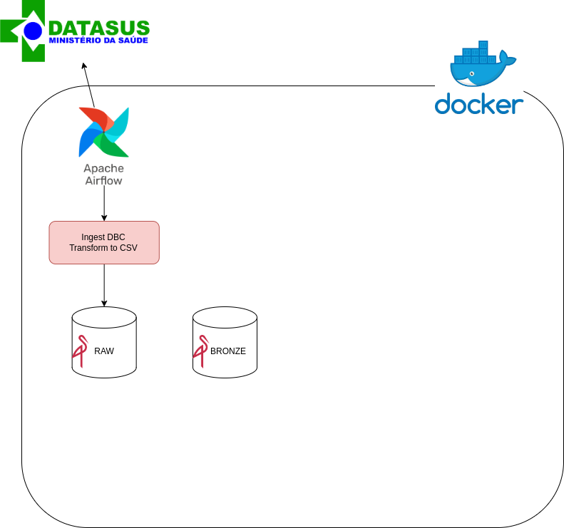

## Dados do Sistema de Informação Hospitalar (SIH) Fortaleza Ceará

#### Este repositório contém scripts para a construção de um datalake com dados do Sistema de Informação Hospitalar (SIH) do DATASUS.

### Funcionalidades:

✅ Ingestão. Uma dag Airflow baixa os arquivos DBC do DATASUS e os armazena em um bucket MinIO chamado raw. Converte os arquivos DBC para CSV, facilitando o acesso e análise dos dados.

### Objetivo:

Criar um ambiente centralizado e estruturado para armazenar e processar os dados do SIH, permitindo análises e insights.

### Próximos passos:

❓ Transformar os dados em formato delta.
❓ Desenvolver dashboards e visualizações para análise dos dados.

